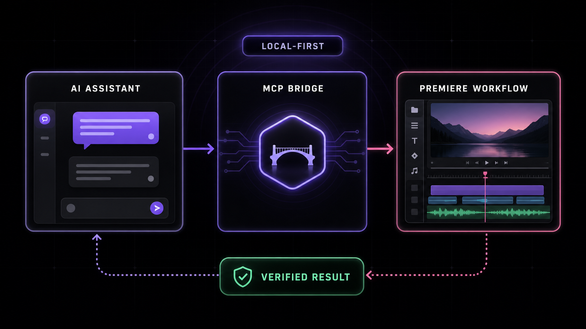

<div align="center">

# Premiere Pro MCP

[](https://mcptoplist.com/server/glama%2Fleancoderkavy%2Fpremiere-pro-mcp)

**Give compatible AI assistants structured control over supported Adobe Premiere Pro workflows.**

282 core tools across 31 modules, 3 resources, and 4 guided workflows. A connected UXP host adds 47 capability-gated tools.

[](LICENSE)
[](https://nodejs.org)
[](https://modelcontextprotocol.io)
[](https://www.npmjs.com/package/premiere-pro-mcp)
[](https://premiere-pro-mcp.fly.dev)
[](https://www.adobe.com/products/premiere.html)

</div>

---


## What is this?

An [MCP (Model Context Protocol)](https://modelcontextprotocol.io) server that lets AI assistants like **Claude**, **Windsurf**, **Cursor**, **GitHub Copilot**, or any MCP-compatible client directly control Adobe Premiere Pro — importing media, editing timelines, applying effects, managing keyframes, exporting, and more.

```text
"Add the B-roll clips to V2, apply a cross dissolve between each, color correct them to match the A-roll, and export a 1080p ProRes."
```

The AI handles the entire workflow through 282 core tools spanning the supported ExtendScript, QE DOM, local media analysis, safe edit-planning, and connection-verification surfaces. A compatible, authenticated UXP panel adds 47 documented, capability-gated tools without replacing the production CEP bridge.

### Latest release: 1.10.0

- **Expanded native UXP workflows:** 21 consolidated tools cover effects, selections, markers,
  bins, sequence settings, imports, keyframes, timeline edits, sequence lifecycle, and encoding.
- **Bounded and transactional execution:** stable IDs, stale-state guards, replay protection,
  capped traversal, grouped Adobe actions, and post-commit readback reduce ambiguous mutations.
- **Least-privilege workspace access:** operators choose the folder available to UXP workflows;
  native paths and persistent tokens stay inside the panel.
- **Truthful compatibility:** CEP remains the production-compatible bridge, and a failed UXP
  mutation is never silently retried through CEP.

See the [v1.10.0 release notes](https://github.com/leancoderkavy/premiere-pro-mcp/releases/tag/v1.10.0)
for complete details. Live installation in Premiere Pro still requires host verification.

---

## Quick Start

### Easiest supported path: Claude Desktop

1. Download the current [Claude Desktop bundle (`.mcpb`)](https://github.com/leancoderkavy/premiere-pro-mcp/releases/download/v1.10.0/premiere-pro-mcp-1.10.0.mcpb).
2. In Claude Desktop, open **Settings > Extensions > Advanced settings > Install Extension**, select the downloaded bundle, and restart Claude Desktop.
3. Download the separate [signed Premiere connector (`.zxp`)](https://github.com/leancoderkavy/premiere-pro-mcp/releases/download/v1.10.0/MCPBridgeCEP.zxp). Open it with your trusted ZXP installer. If your computer has no ZXP installer, use the npm connector installer in **Advanced setup** below.
4. Restart Premiere, open a project, then open **Window > Extensions > MCP Bridge**.
5. In Claude, enter: `Safely check my Premiere connection with verify_premiere_connection. Make no changes.`

The Claude bundle contains the local MCP server, so this route does not require Node.js. The Premiere connector is a separate required install. The first prompt is read-only and reports whether the server is installed, configured, connected, and live-verified.

### Other AI assistants

Cursor, VS Code/Copilot, Windsurf, and other MCP clients do not currently have a project-provided one-click installer. Use their MCP settings with the advanced npm route below. Keep the assistant, server, connector, and Premiere on the same computer.

<details>
<summary><strong>Advanced setup: npm or source</strong></summary>

#### Before you begin

- Node.js **20.19 or newer** on Windows or macOS.
- Adobe Premiere Pro **2020–2026**. Keep Premiere, the CEP bridge, and your MCP client on the same computer for the recommended local setup.
- Optional: [ffmpeg](https://ffmpeg.org/download.html) on `PATH` for `detect_silence`
  (`brew install ffmpeg` on macOS or `winget install Gyan.FFmpeg` on Windows).
  The production Docker image already includes it.

#### 1. Install

**Option A — npm:**

```bash
npm install -g premiere-pro-mcp
```

**Option B — Clone from source:**

```bash
git clone https://github.com/leancoderkavy/premiere-pro-mcp.git
cd premiere-pro-mcp
npm install
npm run build
```

#### 2. Install the CEP plugin

**If installed via npm:**

```bash
premiere-pro-mcp --install-cep
```

**If cloned from source:**

```bash
npm run install-cep
```

This installs the plugin into Premiere Pro's per-user extensions folder and enables debug mode.

#### 3. Check the setup

```bash
premiere-pro-mcp --doctor
```

Then ask your MCP client to run `verify_premiere_connection`. The check is read-only.

</details>

---

## Publishing to npm

The easiest repeatable path is the token-free GitHub Actions workflow:

1. In the npm package settings, configure GitHub Actions as the trusted publisher for
   `leancoderkavy/premiere-pro-mcp` and workflow file `npm-publish.yml`.
2. Allow the `npm publish` action.
3. Open **Actions -> Publish npm -> Run workflow** and keep the default `latest` tag.

The workflow installs dependencies, builds, runs tests, verifies the packed files, refuses to
republish an existing version, then publishes through short-lived OIDC credentials with automatic
provenance. No npm token or recurring OTP is required.

For local publishing, use the guided helper:

```bash
npm run publish:npm
```

Useful local variants:

```bash
npm run publish:npm:dry-run
NPM_OTP=123456 npm run publish:npm
NPM_TOKEN=npm_xxx npm run publish:npm
```

<details>
<summary>Manual installation (macOS)</summary>

```bash
mkdir -p ~/Library/Application\ Support/Adobe/CEP/extensions
ln -s "$(pwd)/cep-plugin" ~/Library/Application\ Support/Adobe/CEP/extensions/MCPBridgeCEP

# Enable unsigned extensions (CSXS 9–14)
for v in 9 10 11 12 13 14; do
  defaults write com.adobe.CSXS.$v PlayerDebugMode 1
done
```

</details>

<details>
<summary>Manual installation (Windows)</summary>

1. Copy the `cep-plugin` folder to `%APPDATA%\Adobe\CEP\extensions\MCPBridgeCEP`
2. Open Registry Editor and set these **String (`REG_SZ`)** values to `1` (not DWORD):
   - `HKEY_CURRENT_USER\Software\Adobe\CSXS.12\PlayerDebugMode`
   - (repeat for CSXS.9 through CSXS.14)

</details>

### 3. Configure your MCP client

If you installed from npm, configure the client to run the global command:

```json
{
  "mcpServers": {
    "premiere-pro": {
      "command": "premiere-pro-mcp"
    }
  }
}
```

If you cloned the repository instead, use the source-build configuration shown below for your client.

<details>
<summary><strong>Claude Desktop</strong></summary>

Edit `~/Library/Application Support/Claude/claude_desktop_config.json` (macOS) or `%APPDATA%\Claude\claude_desktop_config.json` (Windows):

```json
{
  "mcpServers": {
    "premiere-pro": {
      "command": "node",
      "args": ["/absolute/path/to/premiere-pro-mcp/dist/index.js"]
    }
  }
}
```

</details>

<details>
<summary><strong>Windsurf / Cascade</strong></summary>

Add to your MCP server configuration:

```json
{
  "premiere-pro": {
    "command": "node",
    "args": ["/absolute/path/to/premiere-pro-mcp/dist/index.js"]
  }
}
```

</details>

<details>
<summary><strong>Cursor</strong></summary>

Add to `.cursor/mcp.json` in your project or global config:

```json
{
  "mcpServers": {
    "premiere-pro": {
      "command": "node",
      "args": ["/absolute/path/to/premiere-pro-mcp/dist/index.js"]
    }
  }
}
```

</details>

<details>
<summary><strong>GitHub Copilot (VS Code)</strong></summary>

Add to your VS Code MCP server configuration:

```json
{
  "mcpServers": {
    "premiere-pro": {
      "command": "node",
      "args": ["/absolute/path/to/premiere-pro-mcp/dist/index.js"]
    }
  }
}
```

</details>

### 4. Verify the bridge in Premiere Pro

1. Open (or restart) Premiere Pro
2. The bridge starts automatically using the default temp directory (or its previously saved setting)
3. Optionally go to **Window > Extensions > MCP Bridge** to confirm the green "Running" status or change the **Temp Directory** to match your MCP client config
4. Ask your AI assistant to run `get_capabilities`, then `ping`, with Premiere open.
5. For a safe first request, ask: *"What is my current Premiere Pro project and active sequence? Do not make changes."*

The default bridge directory is derived from the operating system on both sides, so most local setups should not set `PREMIERE_TEMP_DIR`. If you override it, use the same absolute path in the MCP server and CEP panel; Windows and macOS paths are not interchangeable.

### Codex plugin

This repository includes an installable Codex plugin that bundles the local MCP
server with a safety-oriented Premiere editing skill.

From a clone of this repository:

```bash
codex plugin marketplace add .
codex plugin add premiere-pro@premiere-pro-mcp
npx -y premiere-pro-mcp@1.10.0 --install-cep
```

Restart Premiere Pro and start a new Codex session after installation. The plugin
launches `premiere-pro-mcp@1.10.0` through `npx`; the separate CEP installation is
required because the MCP server communicates with the running Premiere host through
the local bridge.

The plugin source lives in [`plugins/premiere-pro`](plugins/premiere-pro), and the
repository marketplace manifest lives in
[`.agents/plugins/marketplace.json`](.agents/plugins/marketplace.json).

### Claude

For Claude Code, add this repository as a marketplace and install the plugin:

```text
/plugin marketplace add leancoderkavy/premiere-pro-mcp
/plugin install premiere-pro@premiere-pro-mcp
```

Then install the Premiere bridge and start a new Claude Code session:

```bash
npx -y premiere-pro-mcp@1.10.0 --install-cep
```

The Claude Code package lives in
[`claude-plugins/premiere-pro`](claude-plugins/premiere-pro), with its marketplace
at [`.claude-plugin/marketplace.json`](.claude-plugin/marketplace.json).

Claude Desktop uses the self-contained MCP Bundle (`.mcpb`) format. Build and
validate the current bundle with:

```bash
npm run build:claude
```

Install the resulting file from `artifacts/` through **Settings > Extensions >
Advanced settings > Install Extension**. The Premiere CEP bridge must still be
installed separately.

### Windows and macOS capability coverage

| Surface | Windows | macOS | Verification boundary |
| :------ | :------ | :---- | :-------------------- |
| CEP production bridge | Premiere Pro 2020–2026 | Premiere Pro 2020–2026 | Run `get_capabilities`, then `ping` with Premiere open |
| UXP preview bridge | Premiere Pro 25.6+ | Premiere Pro 25.6+ | Live loopback WebSocket and host API verification required |
| npm CEP installer | Copies plugin and verifies `REG_SZ` debug keys | Copies plugin and verifies the installed manifest/debug settings | Restart Premiere after installation |
| CI build and unit tests | Node 20, 22, and 24 | Node 20, 22, and 24 | GitHub-hosted OS runners; no Adobe host is available in CI |

`get_capabilities` reports the current operating system, temp directory, CEP/UXP coverage, enabled authority profile, and any live-host verification still required. It also includes the full `tools` catalog generated from the tools registered by the server, including tools disabled by the active profile. Every entry identifies:

- the execution backend (`local`, CEP/ExtendScript, QE, or orchestrator);
- static support status (`supported`, `limited`, `experimental`, or `unsupported`);
- the minimum Premiere version known to the server;
- the required authority and whether the current profile enables it;
- the verification boundary and whether a live Premiere host is required; and
- relevant operational notes.

QE-backed tools are reported as `experimental` because QE is undocumented and can vary between Premiere builds. Authority availability is reported separately from implementation support, so disabling `edit`, for example, does not incorrectly label editing tools as unsupported. Static metadata never claims that a Premiere operation succeeded; use `ping` and inspect each tool result for runtime evidence.

MCP `tools/list` is filtered to the active authority profile. The default
`inspect,edit,export,filesystem` profile advertises 280 of the 282 registered
tools and omits `execute_extendscript` and `evaluate_expression`, which require
explicit `unsafe-script` authority. `ping` and `get_capabilities` remain visible
under every profile so a restricted or misconfigured server can still explain
its state. The call-time capability guard remains authoritative even if listing
metadata is wrong.

The MCP handshake reads `serverInfo.version` from the installed `package.json`,
so clients receive the package version that is actually running rather than a
separately maintained literal.

Tools with mixed execution boundaries can provide explicit operational metadata at registration. This is used for local file verification, static feature-support reports, and hybrid local-plus-Premiere validation so the capability catalog does not infer a host dependency from naming alone.

### Collaboration and AI feature boundaries

`get_advanced_feature_support` returns a machine-readable matrix for Productions,
Team Projects, Frame.io, Media Intelligence, Generative Extend, Object Mask,
caption translation, Speech-to-Text, Enhance Speech, and Remix. Pass an optional
Premiere version, intended backend, confirmed entitlements, and network state to
evaluate prerequisites without conflating them with API availability. It
distinguishes documented APIs from entitlements, network prerequisites, separate
service APIs, and user-assisted operations without using menu automation or
private APIs.

The report tool itself is local: it does not contact Premiere and is callable
through the current MCP server. Each feature entry separately reports whether
its operations are callable through the production CEP transport. Productions
reports only static backend/version eligibility until a UXP host performs live
capability negotiation.

- Productions exposes documented read-only state through UXP, but the production
  MCP transport is still CEP.
- Frame.io needs a separately authenticated Frame.io API integration; an account
  entitlement alone does not make it callable through Premiere's DOM.
- Transcript JSON import/export is documented in UXP. Starting Speech-to-Text is not.
- The remaining AI operations are user-assisted or unsupported by documented
  public APIs. The tool explains what can be inspected after a user completes
  the operation and where artifact provenance cannot be established safely.
- The server never uses menu automation, private APIs, clip-name heuristics, or
  duration changes as proof that an AI operation occurred.

### Authenticated UXP connection

The MCP server can accept a local UXP panel connection and invoke the UXP commands that are currently implemented:

```bash
PREMIERE_UXP_TOKEN="replace-with-a-long-random-secret" premiere-pro-mcp
```

Enter the same token in the UXP panel. The listener binds only to `127.0.0.1:7777`, authenticates the WebSocket upgrade, requires a versioned capability handshake, correlates concurrent requests, and fails pending work on timeout or disconnect. Set `PREMIERE_UXP_PORT` to use another loopback port.

When enabled, MCP discovery includes the original 19 UXP tools, 21 consolidated stable workflows, and seven third-wave tools. The first expansion covers effects, deterministic timeline selection, selection batches, scene detection, proxy/ingest, relink, metadata, color conformance, Source Monitor audition, storage, and least-privilege workspace access. The second adds Project-panel selection, marker CRUD, bin organization, sequence settings, imports, typed effect parameters/keyframes, track-item transforms, SequenceEditor timeline edits, sequence lifecycle, and AME encoding. The third wave begins with a redacted event journal, conservative AME terminal receipts, explicit host-readiness gates, safe multi-project sessions, lease-based growing-media control, namespaced workflow checkpoints, bounded media-health maintenance, and caption-aware track mute state documented in [the third-wave workflow matrix](docs/third-wave-uxp-workflows.md). See also [the first stable workflow matrix](docs/uxp-stable-workflows.md) and [the next-ten workflow matrix](docs/uxp-next-ten-workflows.md). Commands are advertised only while the authenticated local UXP bridge is connected; the host capability handshake remains the authority for support in the running Premiere build. A failed UXP command is never silently retried through CEP because the first operation may have partially succeeded.

The panel now requests access to one operator-selected workspace instead of declaring full filesystem access. Choose the folder in the panel before invoking a path-based UXP workflow. Media, relink, preset, export, and Source Monitor file paths must remain inside it; the persistent capability token and native root path are never returned over MCP. Lexical containment alone cannot exclude symlink, junction, or reparse-point escapes, and Adobe's request-scoped UXP filesystem API does not document canonical-path resolution. Builds without a host-supplied canonical resolver therefore advertise path-based UXP commands as unsupported and fail closed at invocation; use the existing CEP fallback for those operations.

Native transcript editing starts with a read-only, revision-locked planning flow. Use
`get_clip_transcript_uxp` to export the transcript Premiere generated for a source
clip, select source-time ranges from that JSON, and pass its SHA-256 revision to
`preview_transcript_edit_uxp`. The preview sorts and merges ranges and returns a
confirmation token without changing the timeline. Premiere does not expose a
documented operation that directly turns deleted transcript text into timeline cuts,
so automatic application remains withheld until the source-to-sequence mapping and
documented reconstruction path pass live-host validation. `search_clip_transcript_uxp`
provides read-only discovery without substituting an external transcription engine.

Premiere 26.2-26.3 hosts also expose documented UXP workflows for revisioned project
inspection, verified project saves, preset-based sequence creation, OTIO/FCP XML
interchange, transcript-language discovery, Object Mask detection, Adobe Media
Encoder control, track renaming, subclip creation, stable marker inspection,
Source Monitor positioning, and clip transcript detection. Mutations accept optional
idempotency keys and return explicit verification outcomes. See [the Adobe UXP 26.3
coverage matrix](docs/adobe-uxp-26.3-coverage.md) and [the UXP capability
foundation](docs/uxp-capability-foundation.md) for the command matrix and live-host
validation boundary.

The stable workflow expansion adds native component-chain effects, deterministic
timeline selection, compound selection batches, scene-edit detection, proxy/ingest control, guarded offline
relink, transactional project/XMP metadata, color and footage-conformance
preflight, full Source Monitor audition, and project/Production storage checks.
See [the stable UXP workflow matrix](docs/uxp-stable-workflows.md) for exact
argument, undo, confirmation, and live-host boundaries.

---

## Architecture



**Local (stdio):**

```text
┌───────────────┐   stdio (MCP)    ┌──────────────┐   File-based IPC   ┌───────────────┐
│  AI Client    │ ◄──────────────► │  MCP Server  │ ◄────────────────► │  CEP Plugin   │
│  (Claude,     │                  │  (Node.js /  │   .jsx commands    │  (runs inside │
│   Windsurf,   │                  │  TypeScript) │   .json responses  │  Premiere)    │
│   Cursor,     │                  └──────────────┘                    └──────┬────────┘
│   Copilot)    │                                                             │
└───────────────┘                                                             │ evalScript()
                                                                              ▼
                                                                       ┌───────────────┐
                                                                       │  Premiere Pro │
                                                                       │  ExtendScript │
                                                                       │  + QE DOM     │
                                                                       └───────────────┘
```

**Remote (HTTP/SSE — Fly.io):**

```text
┌───────────────┐  HTTP+SSE (MCP)  ┌─────────────────────┐   File-based IPC   ┌──────────────┐
│  AI Client    │ ◄──────────────► │  MCP Server         │ ◄────────────────► │  CEP Plugin  │
│  (any MCP     │                  │  premiere-pro-mcp   │   .jsx / .json     │  (Premiere)  │
│   client)     │                  │  .fly.dev           │   shared volume    └──────────────┘
└───────────────┘                  └─────────────────────┘
```

1. AI client invokes an MCP tool (e.g., `add_to_timeline`)
2. MCP server generates ES3-compatible ExtendScript with helper functions prepended
3. Script is written to a `.jsx` command file in a shared temp directory
4. CEP plugin polls for command files, executes via `CSInterface.evalScript()`
5. Result JSON is written to a response file and returned to the AI

The file-based IPC bridge is simple, reliable, and works across macOS and Windows without network sockets.

---

## Tools (282 core total; 280 under the default profile; 327 with a connected UXP bridge)

### Discovery & Inspection (10 + 10)

| Tool | Description |
| :--- | :---------- |
| `get_project_info` | Current project name, path, sequences, items |
| `get_active_sequence` | Detailed active sequence with all clips |
| `list_project_items` | All items in the project panel |
| `get_full_project_overview` | Comprehensive snapshot: bin tree, sequences, media types |
| `get_full_sequence_info` | Exhaustive sequence data: tracks, clips, effects, markers |
| `get_full_clip_info` | Everything about a clip: effects, keyframes, metadata |
| `get_timeline_summary` | Human-readable overview: duration, coverage %, effects |
| `search_project_items` | Filter by name, extension, offline status, color label |
| `get_premiere_state` | Full snapshot: project, sequence, playhead, selection |
| `inspect_dom_object` | Explore any Premiere Pro DOM object interactively |
| `get_advanced_feature_support` | Collaboration/AI API support, prerequisites, entitlements, and user-assisted boundaries |

### Project Management (26)

| Tool | Description |
| :--- | :---------- |
| `save_project` / `save_project_as` / `open_project` | File operations |
| `create_project` / `close_project` | Project lifecycle |
| `import_media` / `import_folder` / `import_ae_comps` | Import media and AE comps |
| `create_bin` / `delete_bin` / `rename_bin` / `create_smart_bin` | Bin management |
| `import_sequences` / `import_fcp_xml` | Import from other projects |
| `create_bars_and_tone` | Generate bars & tone media |
| `set_scratch_disk_path` | Configure scratch disks |
| `consolidate_and_transfer` | Project Manager consolidation |

### Timeline & Editing (10 + 27 advanced)

| Tool | Description |
| :--- | :---------- |
| `add_to_timeline` / `overwrite_clip` | Insert and overwrite edits |
| `ripple_delete` | Remove clip and close gap (QE) |
| `roll_edit` / `slide_edit` / `slip_edit` | Professional trim modes (QE) |
| `move_clip_to_track` | Move between tracks (QE) |
| `set_clip_speed_qe` / `reverse_clip` | Speed/reverse (QE) |
| `split_clip` / `trim_clip` / `move_clip` | Basic edits |
| `set_clip_properties` | Opacity, scale, rotation, position |
| `link_selection` / `unlink_selection` | Link/unlink A/V |

> **Premiere Pro 26.3 compatibility:** some installations silently ignore QE structural edits
> (`ripple_delete`, razor/split) and existing effect-parameter writes. These tools now verify
> the resulting sequence state and return an error instead of a false success. For structural
> edits, rebuild the wanted source ranges into a new sequence with `create_sequence` and
> `add_to_timeline`. Native transitions are unavailable when the host does not expose
> `qeTrack.addTransition`; overlay clips remain a workaround for transitions that do not need
> to blend adjacent source frames. See [issue #21](https://github.com/leancoderkavy/premiere-pro-mcp/issues/21).

### Effects & Color (8)

| Tool | Description |
| :--- | :---------- |
| `apply_effect` / `apply_audio_effect` | Apply by name (QE) |
| `remove_effect` / `remove_all_effects` | Remove effects |
| `color_correct` | Lumetri: exposure, contrast, temperature, etc. |
| `apply_lut` | Apply LUT files |
| `stabilize_clip` | Warp Stabilizer with configurable settings |

### Keyframes (8)

| Tool | Description |
| :--- | :---------- |
| `add_keyframe` / `get_keyframes` | Create and read keyframes |
| `remove_keyframe` / `remove_keyframe_range` | Delete keyframes |
| `set_keyframe_interpolation` | Linear / Hold / Bezier |
| `get_value_at_time` | Query interpolated value at any time |
| `set_color_value` | Set color properties on effects |

### Export & Encoding (16)

| Tool | Description |
| :--- | :---------- |
| `export_sequence` | Export via Adobe Media Encoder |
| `validate_export_preset` | Validate an `.epr` file and resolve its output extension in Premiere |
| `verify_delivery_file` | Verify output size and calculate SHA-256/SHA-512 checksums |
| `capture_frame` | Export frame as PNG, return as base64 image |
| `export_as_fcp_xml` / `export_aaf` / `export_omf` | Interchange formats |
| `encode_project_item` / `encode_file` | Direct encoding |
| `start_batch_encode` | Start render queue |

Premiere's documented automation surfaces do not currently expose OTIO or EDL
interchange, Render and Replace, cloud publishing, or Content Credentials export
configuration. `get_capabilities` reports these delivery gaps explicitly rather
than presenting UI-only operations as available tools.

### Source Monitor & Playback (7 + 4)

| Tool | Description |
| :--- | :---------- |
| `open_in_source` / `close_source_monitor` | Source monitor control |
| `insert_from_source` / `overwrite_from_source` | 3-point editing |
| `play_timeline` / `stop_playback` | Playback control (QE) |
| `play_source_monitor` | Play in source monitor |

### Selection & Clipboard (7 + 6)

| Tool | Description |
| :--- | :---------- |
| `select_clips_by_name` / `select_clips_in_range` | Smart selection |
| `copy_effects_between_clips` | Copy effects via QE |
| `batch_apply_effect` | Apply effect to multiple clips |
| `set_blend_mode` | 27 blend modes |

### Media Properties (16)

| Tool | Description |
| :--- | :---------- |
| `set_offline` / `has_proxy` / `detach_proxy` | Offline/proxy management |
| `set_override_frame_rate` | Override FPS |
| `set_scale_to_frame_size` | Auto-scale to sequence frame |
| `get_xmp_metadata` / `set_xmp_metadata` | Raw XMP access |
| `get_color_space` | Color space info |

### Sequence Management (11)

| Tool | Description |
| :--- | :---------- |
| `create_sequence` / `create_sequence_from_preset` | Create sequences from `.sqpreset` files without opening Premiere's modal dialog |
| `duplicate_sequence` / `delete_sequence` | Manage sequences |
| `auto_reframe_sequence` | Auto-reframe for social media |
| `attach_custom_property` | FCP XML custom properties |
| `unnest_sequence` | Replace nested sequence with its clips |

### Workspace & Captions (2 + 1)

| Tool | Description |
| :--- | :---------- |
| `get_workspaces` / `set_workspace` | Switch workspace layouts |
| `create_caption_track` | Create caption/subtitle tracks |

### Scripting (2)

| Tool | Description |
| :--- | :----------- |
| `execute_extendscript` | Run arbitrary ExtendScript (ES3); requires explicit `unsafe-script` authority |
| `evaluate_expression` | Evaluate a one-line expression; requires explicit `unsafe-script` authority |

### ...and 100+ more

Track targeting, batch operations, markers, audio levels, motion/transform, metadata, sequence settings, navigation, project analysis, and more. Run `get_project_info` to get started — the AI will discover what it needs.

---

## MCP Resources

The server exposes three LLM context resources and four workflow prompts:

| Resource URI | Description |
| :----------- | :---------- |
| `config://premiere-instructions` | Best practices: workflow order, timeline rules, effect tips, error handling |
| `config://extendscript-reference` | Complete ExtendScript API reference for writing custom scripts |
| `config://premiere-workflows` | Machine-readable catalog for rough cuts, dialogue cleanup, captions, and delivery |

These are automatically available to MCP clients that support resources, giving the AI deep context about how to drive Premiere Pro effectively.

---

## Remote Deployment (Fly.io)

The server includes an HTTP/SSE transport (`src/http-server.ts`) for remote access via [mcp-remote](https://github.com/geelen/mcp-remote) or any MCP client that supports Streamable HTTP.

A live instance is running at **https://premiere-pro-mcp.fly.dev**.

### Connect via mcp-remote

```json
{
  "mcpServers": {
    "premiere-pro": {
      "command": "npx",
      "args": ["mcp-remote", "https://premiere-pro-mcp.fly.dev/mcp"]
    }
  }
}
```

### Self-host on Fly.io

```bash
# Clone and deploy your own instance
git clone https://github.com/leancoderkavy/premiere-pro-mcp.git
cd premiere-pro-mcp
fly apps create your-app-name
# Required: add bearer token auth
fly secrets set MCP_AUTH_TOKEN=your-secret-token
fly deploy --remote-only
```

Then connect with:

```json
{
  "mcpServers": {
    "premiere-pro": {
      "command": "npx",
      "args": ["mcp-remote", "https://your-app-name.fly.dev/mcp",
               "--header", "Authorization: Bearer your-secret-token"]
    }
  }
}
```

> **Note:** The file bridge still requires the CEP plugin to share the same `PREMIERE_TEMP_DIR`. For cloud deployments this means running a sync agent or using `fly proxy` / WireGuard to reach your local machine.
> `detect_silence` can analyze only media paths available inside the server filesystem; a desktop-only path is not automatically available to a remote Fly machine.

---

## Environment Variables

| Variable | Description | Default |
| :------- | :---------- | :------ |
| `PREMIERE_TEMP_DIR` | Shared temp directory for MCP ↔ CEP communication | OS temp dir + `/premiere-mcp-bridge` |
| `PREMIERE_TIMEOUT_MS` | Command timeout in milliseconds | `30000` |
| `PREMIERE_DEFAULT_SEQUENCE_PRESET` | Override the auto-discovered `.sqpreset` used by `create_sequence` | auto-discovered |
| `PREMIERE_MCP_CAPABILITIES` | Comma-separated authority profile; add `unsafe-script` only when raw scripting is required | `inspect,edit,export,filesystem` |
| `PREMIERE_MCP_DEBUG` | Set to `1` (or `true`) to emit verbose server diagnostics to stderr | unset |
| `PORT` | HTTP port (HTTP/SSE transport only) | `3000` |
| `MCP_AUTH_TOKEN` | Bearer token required by the HTTP transport | unset |
| `ALLOW_UNAUTHENTICATED` | Set to `1` to run HTTP without auth (unsafe; throwaway instances only) | unset |
| `POSTHOG_API_KEY` | PostHog project token; enables privacy-safe MCP usage telemetry | unset |
| `POSTHOG_HOST` | PostHog ingestion host | `https://us.i.posthog.com` |
| `POSTHOG_ENVIRONMENT` | Environment property attached to telemetry events | `production` |
| `POSTHOG_DISTINCT_ID` | Optional stable anonymous server identifier | Fly machine ID or random boot ID |

When PostHog is enabled, the server records `mcp_connection_attempt`,
`mcp_request`, and `mcp_tool_call`. Events contain operational fields such as
method, tool name, outcome, status code, and duration. Authentication tokens,
IP addresses, MCP arguments, project paths, media names, and tool results are
never sent. Person profiles are disabled for these events.

---

## Project Structure

```text
premiere-pro-mcp/
├── src/
│   ├── index.ts                 # Entry point — stdio transport setup
│   ├── http-server.ts           # Entry point — HTTP/SSE transport (Fly.io / remote)
│   ├── server.ts                # MCP server — registers 280 tools, filtered by authority profile
│   ├── bridge/
│   │   ├── file-bridge.ts       # File-based IPC (write .jsx, poll .json)
│   │   └── script-builder.ts    # ExtendScript generator with ES3 helpers
│   ├── tools/                   # 31 tool modules
│   │   ├── discovery.ts         # Project discovery and queries
│   │   ├── recovery.ts          # Read-only autosave discovery and private bridge telemetry
│   │   ├── project.ts           # Project management and import
│   │   ├── media.ts             # Media and proxy management
│   │   ├── sequence.ts          # Sequence creation and settings
│   │   ├── timeline.ts          # Timeline clip operations
│   │   ├── effects.ts           # Effect application and color correction
│   │   ├── transitions.ts       # Transition management (QE DOM)
│   │   ├── audio.ts             # Audio levels, keyframes, and ffmpeg silence analysis
│   │   ├── av-settings.ts       # Documented AV inspection, mapping, and capability boundaries
│   │   ├── text.ts              # Text overlays and MOGRTs
│   │   ├── markers.ts           # Sequence and clip markers
│   │   ├── tracks.ts            # Track add/delete/lock/visibility
│   │   ├── playhead.ts          # Playhead, work area, in/out points
│   │   ├── metadata.ts          # Metadata, XMP, color labels
│   │   ├── export.ts            # Export, frame capture, encoding
│   │   ├── advanced.ts          # QE DOM: ripple, roll, slide, slip, speed
│   │   ├── keyframes.ts         # Keyframe CRUD and interpolation
│   │   ├── scripting.ts         # Execute arbitrary ExtendScript
│   │   ├── inspection.ts        # Deep project/sequence/clip inspection
│   │   ├── selection.ts         # Clip selection utilities
│   │   ├── clipboard.ts         # Copy effects, batch operations
│   │   ├── source-monitor.ts    # Source monitor control
│   │   ├── track-targeting.ts   # Track targeting, motion, audio props
│   │   ├── utility.ts           # Batch ops, analysis, navigation
│   │   ├── health.ts            # Connectivity ping
│   │   ├── workspace.ts         # Workspace layout switching
│   │   ├── captions.ts          # Caption track creation
│   │   ├── playback.ts          # Timeline/source playback control
│   │   └── project-manager.ts   # Project consolidation/transfer
│   └── resources/
│       └── extendscript-reference.ts  # API reference for LLM context
├── cep-plugin/                  # CEP panel that runs inside Premiere Pro
│   ├── CSXS/manifest.xml        # Extension manifest (PPRO 14.0+)
│   ├── index.html               # Panel UI
│   ├── main.js                  # Bridge polling and script execution
│   ├── host.jsx                 # ExtendScript entry point
│   └── CSInterface.js           # Adobe CEP interface library
├── scripts/
│   ├── install-cep.sh           # macOS CEP installer (symlink + debug mode)
│   └── install-cep.ps1          # Windows CEP installer (copy + REG_SZ debug mode)
├── Dockerfile                   # Multi-stage Docker build for Fly.io
├── fly.toml                     # Fly.io deployment config
├── RESEARCH.md                  # API research and implementation status
├── CONTRIBUTING.md              # Contribution guidelines
├── CHANGELOG.md                 # Version history
└── LICENSE                      # MIT License
```

---

## Technical Details

### CEP and UXP backends

CEP remains the production backend because it provides broad ExtendScript access and the undocumented **QE DOM** used for effects, ripple deletes, and advanced trims across Premiere Pro 2020–2026. The packaged `uxp-plugin` is a Premiere 25.6+ preview backend for supported frame export, capability discovery, and state events. It does not silently retry failed UXP mutations through CEP.

### ExtendScript Compatibility

All generated scripts use **ES3 syntax** (`var`, manual `for` loops, no arrow functions, no `let`/`const`) since ExtendScript is based on ECMAScript 3. The bridge writes a versioned helper library to the shared temp directory and loads it once per ExtendScript engine via `$.evalFile`; each command then sends only its tool-specific script.

### Security

Understand the trust model before deploying this: **any client that can reach the MCP
server can control Premiere Pro.** `execute_extendscript` and `evaluate_expression` are
arbitrary-code-execution tools by design and are omitted from discovery and denied at call time
by default. Enable them only by setting
`PREMIERE_MCP_CAPABILITIES=inspect,edit,export,filesystem,unsafe-script`.

- **Run it locally over stdio** unless you have a specific reason not to. That's the safe default.
- **The HTTP transport (`http-server`) requires `MCP_AUTH_TOKEN`** and refuses to start
  without it. It binds `0.0.0.0` and is remotely reachable, so never expose it publicly
  without a strong token (set `ALLOW_UNAUTHENTICATED=1` only for a throwaway public instance).
- The bridge temp directory is created private to your user (mode `0700`), and the server
  refuses to use one owned by another user — relevant on shared machines, where the CEP
  panel would otherwise execute any `cmd_*.jsx` staged there.
- There is a 500 KB script size limit, and a small regex check that rejects `eval()`,
  `new Function()`, and `System.callSystem()` in tool-generated scripts. **This is a guard
  rail, not a sandbox** — it is trivially bypassable and is not a security boundary. Do not
  rely on it to contain untrusted input; the real boundary is who can reach the server.

### QE DOM

Many tools use the undocumented QE DOM (enabled via `app.enableQE()`). These tools are marked with "Uses QE DOM" in their descriptions. The QE DOM provides capabilities unavailable through the standard ExtendScript API:

- Apply effects and transitions by name
- Ripple delete, roll/slide/slip edits
- Set clip speed and reverse
- Frame blending and time interpolation
- Remove all effects from a clip

---

## Troubleshooting

<details>
<summary><strong>CEP plugin doesn't appear in Premiere Pro</strong></summary>

1. Verify debug mode:
   - macOS: `defaults read com.adobe.CSXS.12 PlayerDebugMode` should return `1`
   - Windows: `reg query "HKCU\SOFTWARE\Adobe\CSXS.12" /v PlayerDebugMode` should report `REG_SZ    1` (a `REG_DWORD` value is not valid for unsigned CEP discovery)
2. Check the plugin exists:
   - macOS: `ls ~/Library/Application\ Support/Adobe/CEP/extensions/MCPBridgeCEP`
   - Windows: `dir "%APPDATA%\Adobe\CEP\extensions\MCPBridgeCEP"`
3. Completely restart Premiere Pro (not just close/reopen the project)
4. Check the CSXS version matches your Premiere Pro version
5. Run `premiere-pro-mcp --diagnose-cep` to check installation metadata and recent Premiere logs.

Version 1.3.0 and newer installs the signed `artifacts/MCPBridgeCEP.zxp` included in the npm
package on Windows. If diagnostics report `Signature verification failed`, reinstall the latest
npm version, fully quit every Premiere process, run `premiere-pro-mcp --install-cep`, and relaunch.

</details>

<details>
<summary><strong>Commands timeout or hang</strong></summary>

1. Open the CEP panel and verify it shows "Running" with a green dot (the bridge normally starts automatically)
2. Ensure temp directories match between MCP client config and CEP panel
3. Read the timeout error: if it reports an in-flight heartbeat, dismiss any open Premiere modal dialog; without a heartbeat, verify the bridge is running and using the same temp directory
4. Increase timeout: set `PREMIERE_TIMEOUT_MS` to `60000` or higher
5. Try `ping` tool to test basic connectivity

</details>

<details>
<summary><strong>AI client can't see tools</strong></summary>

1. Restart the AI client after editing config
2. Verify the path to `dist/index.js` is absolute and correct
3. Run `node dist/index.js` in a terminal to check for startup errors
4. Ensure `npm run build` completed without errors

</details>

<details>
<summary><strong>QE DOM tools fail</strong></summary>

1. QE tools require an active sequence — open one first
2. Some QE operations are index-based and can fail if clips have been reordered
3. Re-query the sequence structure after QE operations

</details>

---

## Contributing

Contributions are welcome! See [CONTRIBUTING.md](CONTRIBUTING.md) for guidelines.

The evidence-backed [next improvement pull-request roadmap](docs/next-improvement-pr-roadmap.md)
breaks the proposed feature, protocol, reliability, and performance work into ten
reviewable changes with explicit dependencies and live-host acceptance gates.

---

## License

[MIT](LICENSE) — free for personal and commercial use.
