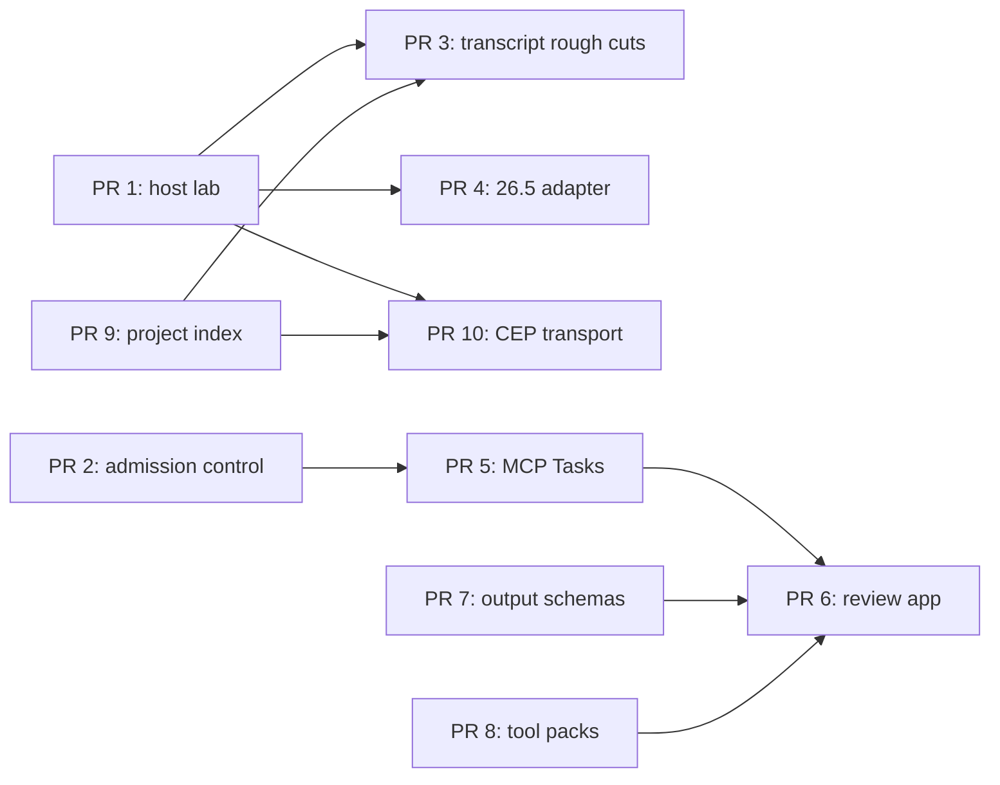

# Next improvement pull-request roadmap

- **Status:** Proposed
- **Research date:** 2026-08-12
- **Baseline:** `premiere-pro-mcp@1.9.3`

## Purpose

This roadmap turns the next product, platform, and performance opportunities into
ten reviewable pull requests. It is intentionally not a claim that the work is
implemented. Each pull request has a narrow responsibility, observable acceptance
criteria, and an explicit host-validation boundary.

The current product already has a broad command surface: 280 registered core tools,
278 tools in the default authority profile, and 19 additional tools when an
authenticated UXP host is connected. The next gains should therefore come from
workflow depth, real-host evidence, bounded execution, and lower end-to-end latency
rather than another undifferentiated expansion of tool names.

## Evidence baseline

- The Adobe 26.3 UXP coverage manifest contains 15 entries, but every entry still
  has `liveHostVerificationStatus: not_run`. Automated adapters and contract tests
  are useful evidence, but they do not prove behavior in Premiere.
- Safe edit plans currently support only `insert_clip` and `remove_clip`. Native
  transcript export, search, and revision-locked deletion preview exist, but an
  end-to-end transcript-to-timeline mutation does not.
- The CEP connector scans its command directory every 200 ms. The MCP side uses
  `fs.watch()` with a polling fallback for responses, but the host side remains a
  polling transport.
- Some UXP commands repeatedly traverse the complete project tree to resolve an
  item by name or ID.
- Structured tool results are returned, but tools do not yet publish strict output
  schemas for client-side validation.
- The production security review identified missing request-size, timeout,
  concurrency, and rate controls on the HTTP MCP endpoint.

## Delivery rules

Every implementation pull request in this roadmap should follow these rules:

1. Preserve the production CEP path until a replacement has equivalent real-host
   evidence on Windows and macOS.
2. Never silently retry a failed UXP mutation through CEP or QE. A host operation
   may have committed before its response failed.
3. Put UXP `Action` creation inside `project.lockedAccess()` and commit it through
   `project.executeTransaction()` when the documented API requires it.
4. Return operation IDs, verification boundaries, and partial outcomes for every
   mutating or long-running workflow.
5. Keep beta Adobe APIs and negotiated MCP extensions behind explicit capability
   probes. Do not advertise them to incompatible hosts or clients.
6. Treat build, contract-test, package, live-host, deployed, and authenticated
   end-to-end evidence as separate states.
7. Avoid telemetry fields containing project names, paths, media names, arguments,
   results, transcript text, or authentication material.

## Recommended dependency order

PRs 1 and 2 can start in parallel. PRs 7 through 9 can begin after their shared
result and benchmark contracts are settled. PR 10 should remain an opt-in transport
until its live-host results beat the file bridge without weakening reliability.

## PR 1 — Real-Premiere compatibility and latency lab

- **Priority:** P0
- **Estimated size:** M
- **Suggested branch:** `codex/live-host-compatibility-lab`

### Scope

- Add a versioned fixture-project manifest for small, medium, and large projects.
- Add a host-runner protocol that records Premiere version, OS, connector artifact
  SHA-256, backend, command, outcome, verification evidence, and timing.
- Exercise every current UXP coverage entry plus representative CEP inspection,
  edit, QE, export, and failure paths.
- Emit a machine-readable compatibility report and a human-readable summary without
  recording project or media names.
- Add p50, p95, and maximum end-to-end latency measurements for bridge dispatch,
  host execution, verification, and total tool duration.

### Acceptance criteria

- The harness can be packaged and run manually on supported Windows and macOS hosts.
- Contract fixtures pass in CI without pretending to be Premiere.
- A live result can update `liveHostVerificationStatus` only when it names the exact
  host version, OS, artifact hash, command, and observable result.
- Reports distinguish `verified`, `committed_unverified`, `unsupported`, `failed`,
  and `not_run`.
- No fixture report contains user project paths, media paths, names, or transcript
  content.

### Non-goals

- CI virtualization is not a substitute for a licensed, interactive Premiere host.
- This PR does not promote UXP from preview to the production default.

## PR 2 — HTTP admission control and Premiere operation scheduler

- **Priority:** P0
- **Estimated size:** M
- **Suggested branch:** `codex/http-admission-control`

### Scope

- Enforce an explicit MCP request-body limit before transport parsing.
- Configure header, request, keep-alive, and socket timeouts.
- Reject unsupported methods and non-exact MCP paths before constructing a server.
- Add per-credential/IP request throttling at the trusted edge, with an in-process
  fallback suitable for a single Fly machine.
- Introduce a bounded operation scheduler: one mutating host operation at a time,
  configurable safe-read concurrency, queue limits, cancellation, and overload
  responses.
- Expose bounded health metrics for active, queued, rejected, timed-out, and
  cancelled operations.

### Acceptance criteria

- Oversized, slow, over-rate, over-concurrency, and unsupported-method requests are
  rejected with deterministic status codes and without invoking a Premiere tool.
- Mutations cannot overlap, while explicitly classified safe reads can use the
  configured read lane.
- Client disconnects cancel queued work and request cancellation for work that has
  not crossed the host-commit boundary.
- Load tests prove bounded memory, sockets, queue depth, and telemetry volume.
- Existing authenticated MCP compatibility tests continue to pass.

### Non-goals

- Rate limits do not replace authentication or Fly firewall controls.
- A cancellation response must not claim that an already-committed host mutation
  was rolled back.

## PR 3 — Revision-locked transcript rough-cut workflow

- **Priority:** P0
- **Estimated size:** L
- **Suggested branch:** `codex/transcript-rough-cut`

### Scope

- Add transcript analysis for explicit text selections, filler words, repeated
  phrases, long pauses, and user-provided deletion ranges.
- Convert source transcript timestamps into timeline ranges while accounting for
  trim points and supported playback speeds.
- Generate a deterministic, revision-locked edit plan and a concise before/after
  duration summary.
- Default to operating on a cloned sequence and require an exact confirmation token
  before mutation.
- Apply supported removals in a documented UXP transaction, preserve linked A/V,
  honor locked tracks, and return per-range verification evidence.
- Reject reversed, remapped, nested, multicam, or otherwise ambiguous mappings until
  each case has a proven transform and live-host fixture.

### Acceptance criteria

- Transcript changes, sequence changes, or changed selections invalidate the
  confirmation token.
- Preview reports the exact source words/ranges, timeline ranges, duration delta,
  unsupported clips, and proposed sequence name without changing Premiere.
- Apply either commits the validated plan with an undo boundary or reports a
  bounded partial outcome; it never reports atomic rollback when none exists.
- Live-host fixtures cover straight clips, trims, linked audio/video, track locks,
  adjacent deletions, and at least one rejected unsupported mapping.
- The workflow closes the practical request in issue #77 without claiming that
  Adobe exposes a native “delete transcript text” API.

### Non-goals

- No undocumented transcript-segment mutation.
- No automatic use of cloud transcription or paid generative services.

## PR 4 — Runtime-gated Premiere 26.5 experimental adapter

- **Priority:** P1
- **Estimated size:** M
- **Suggested branch:** `codex/uxp-26-5-experimental`

### Scope

- Add a generated API-diff check between the pinned stable Adobe declaration package
  and the current beta package.
- Add experimental adapters for APIs currently visible in the 26.5 beta declarations:
  clip transcription, transcript language-pack checks, C2PA manifest inspection,
  media-cache purge, and work-area utilities.
- Put destructive or resource-heavy actions behind explicit authority, runtime host
  version, method probes, and an experimental opt-in.
- Add separate stable, beta-contract, and live-beta evidence fields to the coverage
  manifest.

### Acceptance criteria

- Stable builds do not import or advertise beta-only APIs by default.
- A 26.3 host lists every beta-only command as unavailable without attempting it.
- A compatible opted-in beta host exposes only the methods it probes successfully.
- C2PA output is bounded and redacts unnecessary manifest data by default.
- Media-cache purge and transcription require explicit confirmation and surface
  their potentially long-running behavior.

### Promotion gate

Move an adapter to the stable surface only after Adobe ships the corresponding stable
package and documentation, contract tests pass against it, and the exact operation is
verified in a real stable Premiere host.

## PR 5 — MCP Tasks for exports and long-running host work

- **Priority:** P1
- **Estimated size:** M-L
- **Suggested branch:** `codex/mcp-task-workflows`

### Scope

- Negotiate the MCP Tasks extension and use task execution only with compatible
  clients.
- Make task support optional for export, proxy creation, transcription, Object Mask
  analysis, Project Manager, and other work that can exceed an interactive request.
- Add task state, progress, input-required, cancellation, result retention, and
  expiration semantics.
- Keep a bounded synchronous compatibility path for clients without Tasks support.
- Persist only minimal task metadata required for recovery; never persist project
  arguments or tool results containing private media information.

### Acceptance criteria

- Compatible clients can start, inspect, cancel, and retrieve a long-running result.
- Incompatible clients receive the documented synchronous behavior or a clear
  capability error, never an unrecognized task handle.
- Cancellation distinguishes queued, pre-host-call, host-in-progress, committed,
  completed, and failed states.
- Task IDs are unguessable, authorization-scoped, bounded in count, and expired.
- Restart and disconnect tests define exactly which task states can be recovered.

### Non-goals

- Tasks do not make a blocking Adobe API cancellable if the host API offers no
  cancellation point.

## PR 6 — MCP App review cockpit

- **Priority:** P1
- **Estimated size:** L
- **Suggested branch:** `codex/edit-review-app`

### Scope

- Add an MCP App for reviewing transcript deletions, compound edit plans, export
  settings, artifact checks, and compatibility warnings.
- Render timeline ranges, duration changes, affected tracks, unsupported operations,
  and verification status in an accessible, sandboxed interface.
- Use MCP elicitation for missing bounded choices such as output path, preset,
  duplicate-sequence name, or confirmation.
- Route every UI action back through the same MCP authority, audit, scheduler, and
  confirmation controls as direct tool calls.

### Acceptance criteria

- Clients without MCP Apps continue to receive a complete text and structured-data
  workflow.
- The app passes keyboard, focus, screen-reader, forced-colors, reduced-motion, and
  390 px layout checks.
- The UI cannot bypass capability checks or send arbitrary tool arguments.
- Stale revisions cannot be approved; the app requires a refreshed preview.
- No remote scripts, project media, or transcript content leave the declared app
  security boundary without an explicit supported workflow.

## PR 7 — Strict output schemas and artifact resource links

- **Priority:** P1
- **Estimated size:** M
- **Suggested branch:** `codex/tool-output-schemas`

### Scope

- Extend tool definitions with JSON Schema 2020-12 output schemas.
- Define shared result types for success, error, operation semantics, verification
  evidence, capability state, task handles, and artifacts.
- Validate structured results before returning them to the MCP client.
- Return resource links for export, report, interchange, and compatibility artifacts
  where the client can access them safely.
- Add stable human-readable titles and icons without changing tool identifiers.

### Acceptance criteria

- Every advertised tool has a valid output schema or an explicit temporary waiver
  tracked in a machine-readable migration list.
- CI invokes representative success and failure paths and rejects schema drift.
- Artifact links are authorization-scoped, path-contained, size-bounded, and do not
  expose arbitrary local files.
- Existing clients still receive the backward-compatible text content block.
- Schema changes follow a documented compatibility and deprecation policy.

## PR 8 — Workflow-scoped tool packs and cacheable discovery

- **Priority:** P1
- **Estimated size:** M
- **Suggested branch:** `codex/workflow-tool-packs`

### Scope

- Define versioned `essential`, `rough-cut`, `audio`, `captions`, `color`, `delivery`,
  `inspection`, and `advanced` tool packs.
- Let operators opt into packs while preserving a documented full-catalog mode.
- Keep capability authority separate from tool-pack visibility.
- Add cache metadata for public or authorization-private `tools/list` responses and
  invalidate it when authority, connector, host, or selected-pack state changes.
- Add tool-list change notifications for clients that negotiate them.

### Acceptance criteria

- Every registered tool belongs to at least one pack and has a tested authority
  classification.
- The essential pack can complete connection diagnosis, inspection, a safe edit
  preview, save, and verified delivery workflows.
- Hidden tools remain denied if called directly without authority.
- Benchmarks report list payload size, schema conversion time, model context size,
  and correct-tool selection on representative prompts.
- Full-catalog behavior remains available during a documented compatibility window.

## PR 9 — Revision-keyed project index and delta snapshots

- **Priority:** P2
- **Estimated size:** M
- **Suggested branch:** `codex/uxp-project-index`

### Scope

- Build a bounded in-panel index keyed by project/item GUID, exact name, normalized
  path hash, item type, and parent identity.
- Invalidate or incrementally update it from documented project events and command
  results; fall back to a full rebuild when event evidence is incomplete.
- Add paginated project-item discovery and revision tokens.
- Emit compact state deltas when possible while retaining full snapshot recovery.
- Coalesce duplicate host events and avoid overlapping snapshot traversals.

### Acceptance criteria

- Large fixture projects demonstrate lower p50/p95 lookup and snapshot latency than
  repeated breadth-first traversal.
- Duplicate names never resolve silently; callers must use stable identity or receive
  all bounded matches.
- Stale revisions return a specific refresh-required result.
- Cache memory and entry count are capped, observable, and released when projects
  close or connectors disconnect.
- Event-loss tests prove that a full rebuild restores correctness.

## PR 10 — Authenticated persistent CEP transport prototype

- **Priority:** P2
- **Estimated size:** L
- **Suggested branch:** `codex/cep-persistent-transport`

### Scope

- Add a loopback-only authenticated WebSocket or local HTTP transport between the
  MCP server and CEP panel.
- Use a versioned hello/capability handshake, bounded frames, request correlation,
  progress events, operation IDs, cancellation requests, and a single mutation lane.
- Retain the private file bridge as an explicit compatibility fallback.
- Add transport selection and diagnostics without changing command backend routing.
- Benchmark dispatch, host, response, CPU wakeups, and failure recovery against the
  current 200 ms CEP directory scan.

### Acceptance criteria

- The listener binds only to loopback, uses a strong shared secret, rejects replayed
  or malformed requests, and never logs secrets or command bodies.
- Disconnect, duplicate result, timeout, modal dialog, Premiere restart, and stale
  panel cases have deterministic recovery behavior.
- A failed persistent-transport mutation is not replayed over the file bridge.
- Windows and macOS live-host reports show a meaningful latency or resource win with
  no regression in correctness.
- File transport remains the default until those results and an upgrade path are
  reviewed.

## Suggested release slices

| Release slice | Pull requests | Outcome |
| --- | --- | --- |
| Reliability foundation | 1, 2 | Measurable host behavior and bounded remote execution |
| Editor workflow | 3, 9 | Safe transcript rough cuts with fast, stable identity resolution |
| Protocol modernization | 5, 7, 8 | Typed, discoverable, cancellable long-running MCP workflows |
| Guided review | 6 | Human-reviewable plans and delivery decisions inside supporting clients |
| Experimental host expansion | 4 | Truthful, runtime-gated evaluation of Premiere 26.5 APIs |
| Transport optimization | 10 | Evidence-backed path away from CEP directory polling |

## Success measures

- At least one promoted Windows and macOS host combination has current, reproducible
  live-host evidence for every advertised UXP mutation.
- Host operation p95, queue wait, bridge dispatch, and verification time are visible
  separately.
- Overload tests demonstrate bounded memory, sockets, queue depth, and request size.
- Transcript rough cuts are revision-locked, previewed, undoable where documented,
  and never applied to the original sequence by default.
- Long exports and analyses can report progress and cancellation state in compatible
  MCP clients.
- The default tool discovery payload is materially smaller without reducing the
  completion rate of representative editor workflows.
- No release claim is based solely on mocks, contract hosts, CI, public HTTP health,
  or package publication.

## Research references

Primary sources used to choose and constrain these recommendations:

- [Adobe Premiere UXP changelog](https://developer.adobe.com/premiere-pro/uxp/changelog/)
- [Adobe Premiere Pro 26.5 beta declarations](https://www.npmjs.com/package/@adobe/premierepro/v/26.5.0-beta.73)
- [Adobe Premiere UXP API fundamentals](https://developer.adobe.com/premiere-pro/uxp/resources/fundamentals/apis/)
- [Adobe Premiere SequenceEditor reference](https://developer.adobe.com/premiere-pro/uxp/ppro_reference/classes/sequenceeditor/)
- [Adobe Premiere 26.3 feature summary](https://helpx.adobe.com/premiere/desktop/whats-new/whats-new.html)
- [MCP 2026-07-28 release](https://blog.modelcontextprotocol.io/posts/2026-07-28)
- [MCP Tools specification](https://modelcontextprotocol.io/specification/2026-07-28/server/tools)
- [MCP Tasks extension proposal](https://modelcontextprotocol.io/seps/2663-tasks-extension)
- [Descript filler-word workflow](https://help.descript.com/hc/en-us/articles/10164806394509-Remove-filler-words)
- [FireCut product workflow](https://firecut.ai/)

These references establish product demand and documented platform capabilities. They
do not prove that a specific operation works in this repository or in a real Premiere
installation; the acceptance gates above provide that missing evidence.
